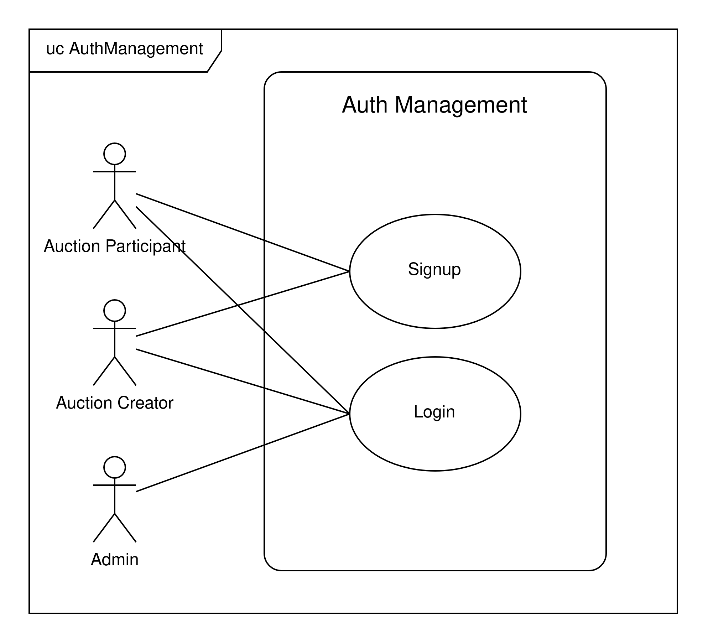
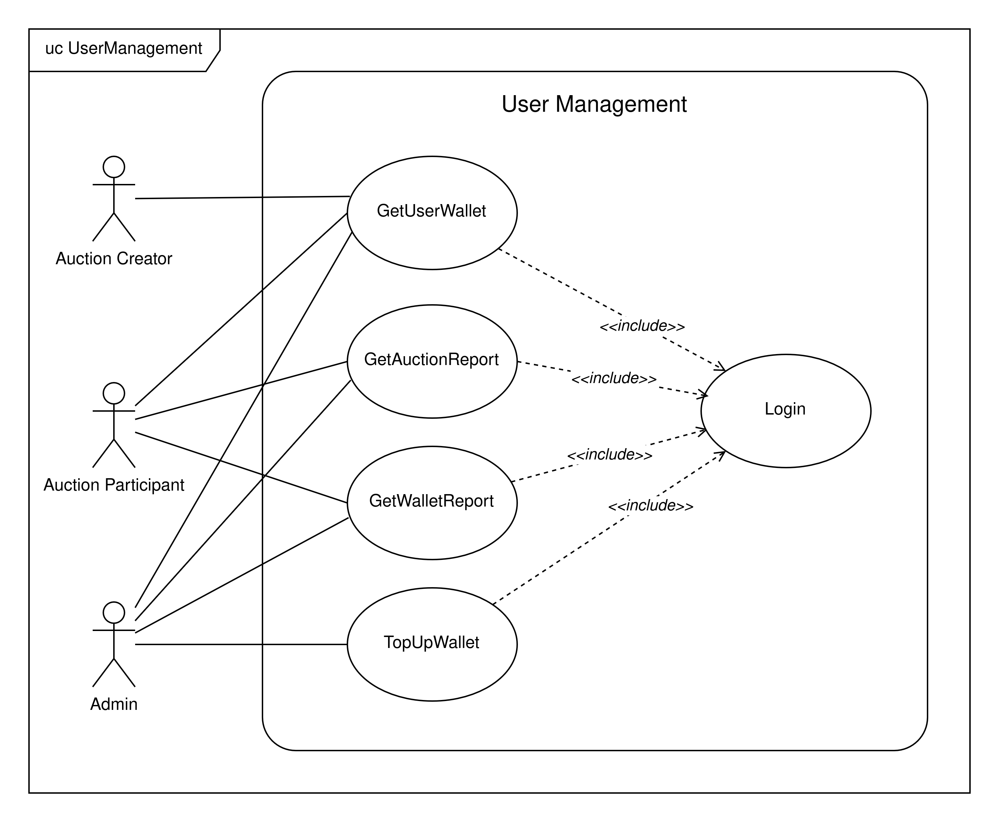
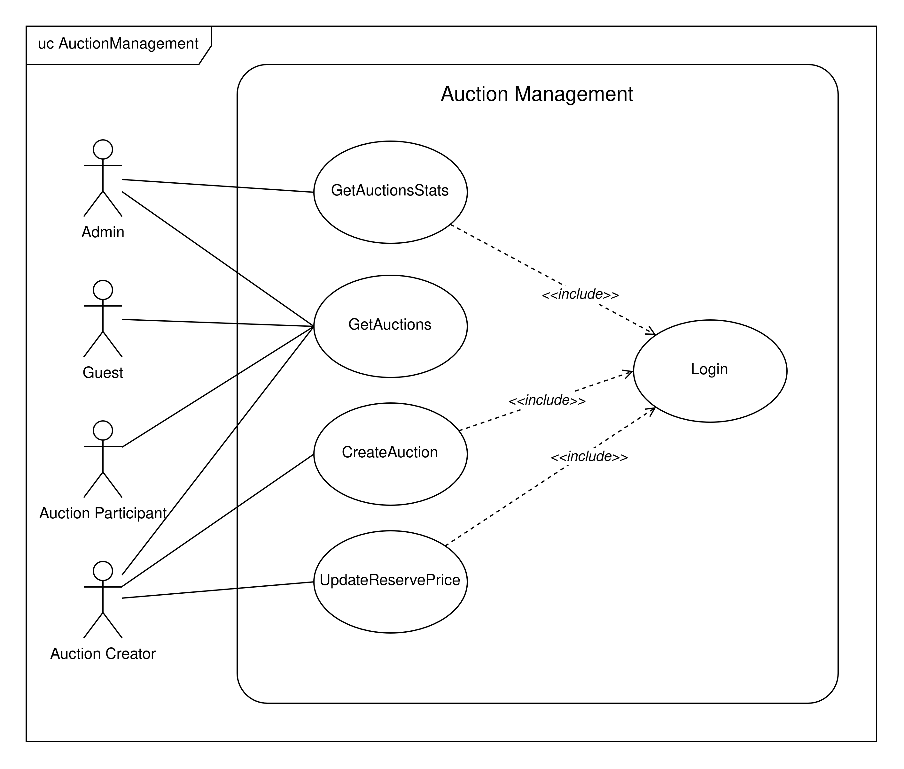
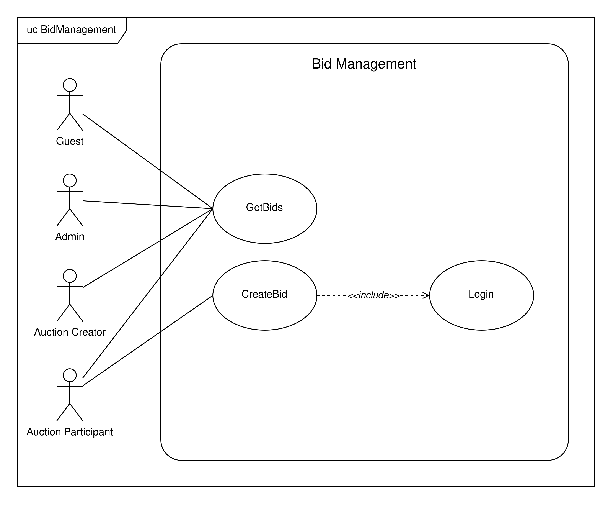
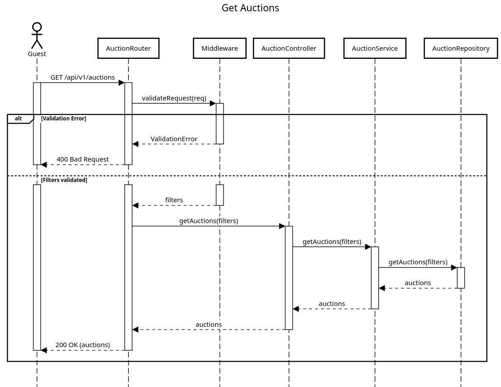
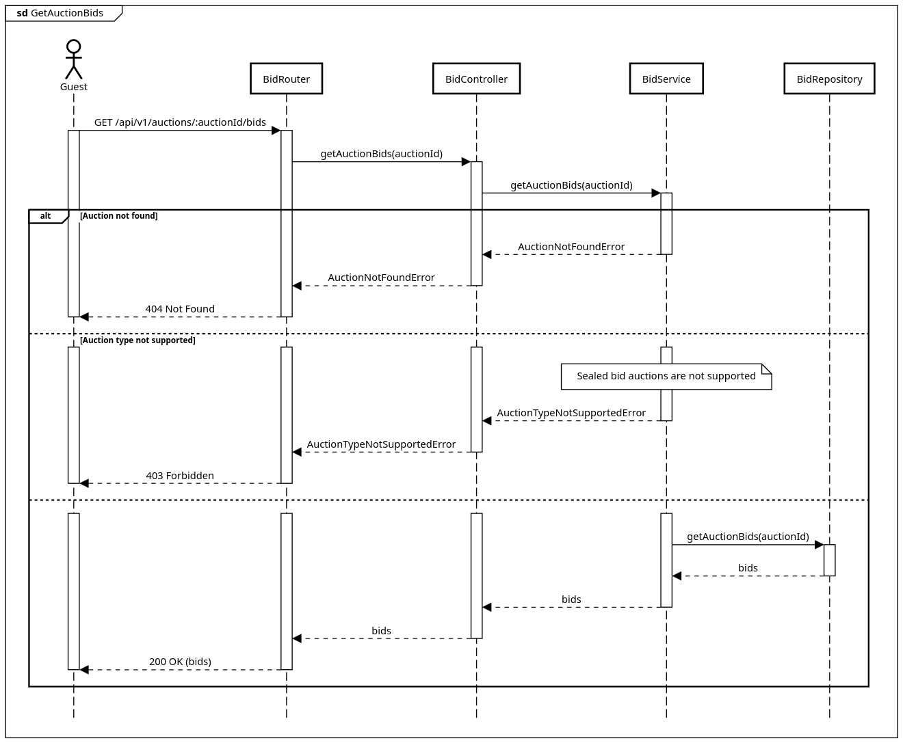
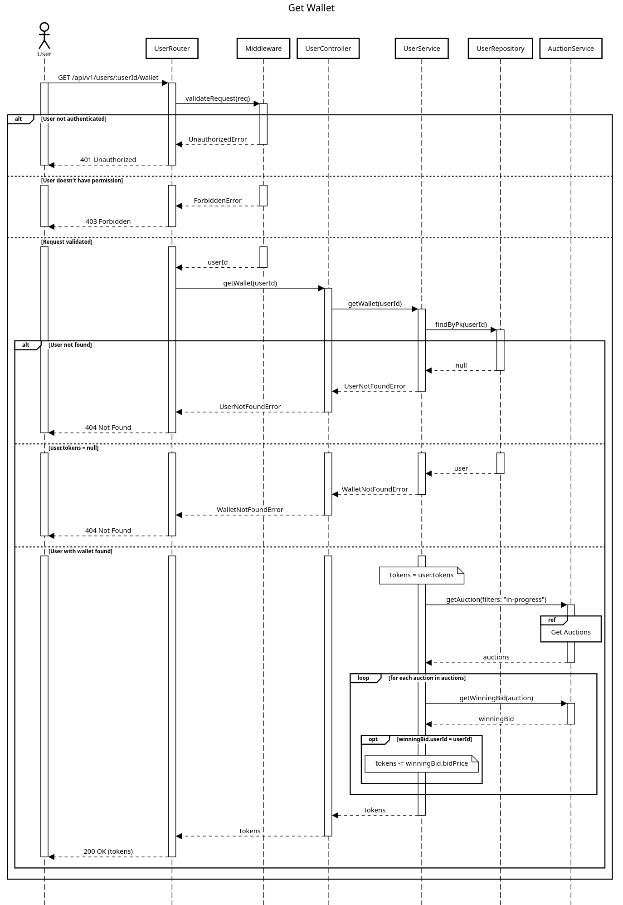
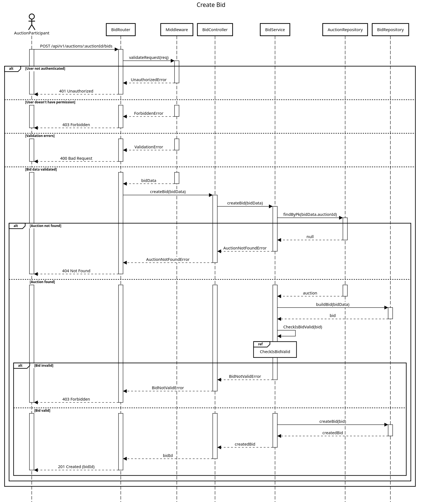
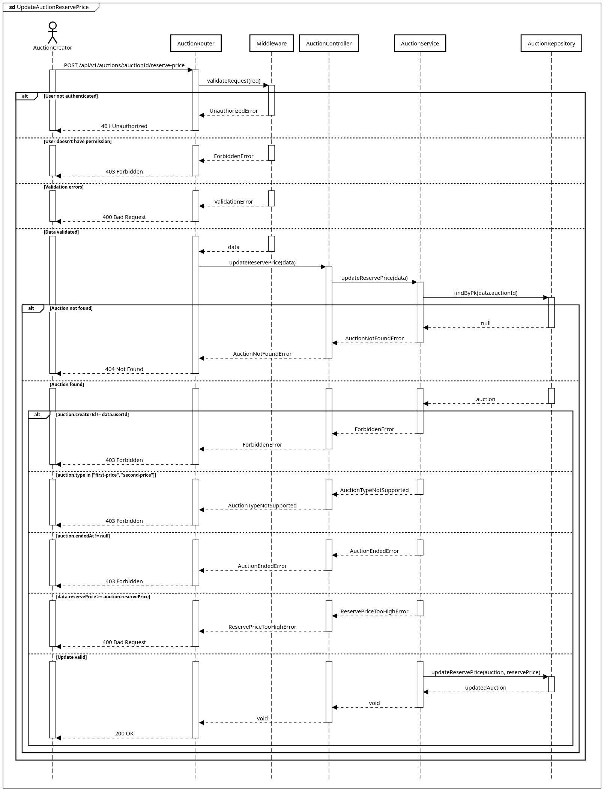

# Auction Platform API
### Progetto Programmazione Avanzata 2025/2026

## Table of contents

- [Auction Management System](#progetto-programmazione-avanzata-20252026)
  - [Indice](#indice)
  - [1. Project description and objectives](#1-project-description-and-objectives)
    - [Key Features](#key-features)
  - [2. Technology stack](#2-technology-stack)
  - [3. Design and UML](#3-design-and-uml)
    - [Core Entities](#core-entities)
  - [4. Design Patterns and Code Architecture](#4-design-patterns-and-code-architecture)
    - [Design Patterns Used](#design-patterns-used)
  - [5. Installation and usage](#5-installation-and-usage)
    - [Prerequisites](#prerequisites)
    - [Setup Instructions](#setup-instructions)

---

## 1. Project description and objectives

This project aims to create an auction management system. The system allows the creation of auctions and the participation to them through bids.

In particular, the system supports the following types of auctions:
- **English Auction**: An ascending-bid auction where the price starts low and bidders openly increase it. The highest bidder wins at the final bid amount.
- **Dutch Auction**: A descending-bid auction where the price starts high and decreases over time. The first bidder to accept wins at the current price.
- **First Price Sealed Bid Auction**: Bidders submit sealed bids without knowing others' bids. The highest bidder wins and pays their own bid amount.
- **Second Price Sealed Bid Auction**: Bidders submit sealed bids without knowing others' bids. The highest bidder wins but pays the second-highest bid amount.

### User functionality
The system provides three types of users:
- `auction-participant`: He has a wallet with a limited number of tokens. He can participate to an auction creating bids.
- `auction-creator`: He can create and update his own auctions.
- `admin`: He can recharge an user wallet and has access to auction stats.

### API endpoints

### Auth
| Method | Endpoint | Description | Authorization |
|---------|----------|-------------|---------------|
| `POST` | `/api/v1/signup` | Signup of a new user | Public |
| `POST` | `/api/v1/login` | User authentication | Public |

### Users
| Method | Endpoint | Description | Authorization |
|---------|----------|-------------|---------------|
| `GET` | `/api/v1/users/:userId/wallet` | Get a user wallet balance | _Admin_ **OR** _User_ with `userId` |
| `GET` | `/api/v1/users/:userId/auction-report` | Get a user's auctions report | _Admin_ **OR** _User_ with `userId` |
| `GET` | `/api/v1/users/:userId/wallet-report` | Get a user's wallet report | _Admin_ **OR** _User_ with `userId` |
| `PUT` | `/api/v1/users/:userId/wallet` | Top up a user's wallet | _Admin_ |

### Auctions
| Method | Endpoint | Description | Authorization |
|---------|----------|-------------|---------------|
| `POST` | `/api/v1/auctions` | Create a new auction | _AuctionCreator_ |
| `GET` | `/api/v1/auctions` | List auctions filtered by the provided criteria | Public |
| `GET` | `/api/v1/auctions/stats` | Get auction statistics grouped by auction type | _Admin_ |
| `PUT` | `/auctions/:auctionId/reserve-price` | Update an auction reserve price | _AuctionCreator_ |

### Bids
| Method | Endpoint | Description | Authorization |
|---------|----------|-------------|---------------|
| `POST` | `/api/v1/auctions/:auctionId/bids` | Create a bid for the specified auction | _AuctionParticipant_ |
| `GET` | `/api/v1/auctions/:auctionId/bids` | List all the bids for the specified auctions | Public |

### Utilities
| Method | Endpoint | Description | Authorization |
|---------|----------|-------------|---------------|
| `GET` | `/health` | Health check | Public |
| `GET` | `/api-docs` | Swagger documentation for the API | Public |


## 2. Technology stack
 - **Node.js**: JavaScript runtime environment
 - **TypeScript**: Static typing for the codebase
 - **Express**: Web framework for the REST API backend
 - **Sequelize**: ORM for PostgreSQL
 - **Zod**: Schema validation and type inference
 - **Auth0**: JWT-based authentication and authorization
 - **Redis**: In-memory store used for query caching
 - **BullMQ**: Redis-backed job queue used for auction settlement/closing
 - **Jest**: Unit and integration testing framework
 - **Winston**: Structured application logging
 - **Awilix**: Dependency injection container
 - **ESLint**: Static code analysis / linting
 - **Swagger**: OpenAPI documentation for the API
 - **Docker & Docker Compose**: Containerization and local orchestration
 - **Postman**: Manual/exploratory API testing

## 3. Design and UML

### Use case diagrams
The following diagrams illustrate the main use cases supported by the system and the interactions between actors and application functionalities. Each diagram focuses on a specific domain area, providing a high-level overview of the available operations and the permissions associated with each actor.

#### Authentication Management
This diagram illustrates the authentication operations supported by the system. All users can log in, while only non-administrator users can sign up.



#### User Management
This diagram illustrates the user-related operations supported by the system. Auction participants, auction creators, and administrators can view wallets. Auction participants and administrators can also view auction and wallet reports, while administrators can top up wallets.



#### Auction Management
This diagram illustrates the auction-related operations supported by the system. All users can view auctions, auction creators can create auctions and update reserve prices, and administrators can access auction statistics.



#### Bid Management
This diagram illustrates the bid-related operations supported by the system. All users can view auction bids, while only auction participants can place bids.



### Sequence diagrams
Route: `GET /api/v1/auctions`



Route: `GET /api/v1/auctions/:auctionId/bids`



Route: `GET /api/v1/users/:userId/wallet`



Route: `POST /api/v1/auctions/:auctionId/bids`



Route: `PUT /api/v1/auctions/:auctionId/reserve-price`



## 4. Design Patterns and Code Architecture

The project follows a layered architecture:

- **Controllers**: HTTP request handlers and response management
- **Services**: Business logic for auction management and bidding
- **Models**: Sequelize ORM models for database entities
- **Middleware**: Authentication, validation, and error handling
- **Utilities**: Helper functions, logging, and error definitions

### Design Patterns Used
- **CSR Pattern**: Separation of concerns between controllers, services and repositories
- **Repository Pattern**: Abstraction of database operations
- **Job Queue Pattern**: Asynchronous processing with BullMQ
- **Singleton Pattern**: Redis and database connections
- **Chain of Responsibility**: Trough routes, middlewares and controllers, services and repositories.

## 5. Installation and usage

### Setup Instructions

1. **Clone the repository**
   ```bash
   git clone https://github.com/simago44/Progetto_PA26.git
   cd Progetto_PA26