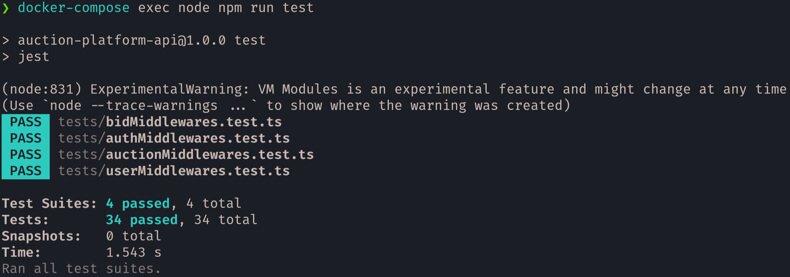

# Auction Platform API
### Progetto Programmazione Avanzata 2025/2026

---

## 1. Project description and objectives

This project aims to create an auction management system. The system allows the creation of auctions and the participation to them through bids.

In particular, the system supports the following types of auctions:
- **English Auction**: An ascending-bid auction where the price starts low and bidders openly increase it. The highest bidder wins at the final bid amount.
- **Dutch Auction**: A descending-bid auction where the price starts high and decreases over time. The first bidder to accept wins at the current price.
- **First Price Sealed Bid Auction**: Bidders submit sealed bids without knowing others' bids. The highest bidder wins and pays their own bid amount.
- **Second Price Sealed Bid Auction**: Bidders submit sealed bids without knowing others' bids. The highest bidder wins but pays the second-highest bid amount.

### User functionality
The system provides three types of users:
- `auction-participant`: He has a wallet with a limited number of tokens. He can participate to an auction creating bids.
- `auction-creator`: He can create and update his own auctions.
- `admin`: He can recharge an user wallet and has access to auction stats.

### API endpoints

### Auth
| Method | Endpoint         | Description          | Authorization |
| ------ | ---------------- | -------------------- | ------------- |
| `POST` | `/api/v1/signup` | Signup of a new user | Public        |
| `POST` | `/api/v1/login`  | User authentication  | Public        |

### Users
| Method | Endpoint                               | Description                  | Authorization                       |
| ------ | -------------------------------------- | ---------------------------- | ----------------------------------- |
| `GET`  | `/api/v1/users/:userId/wallet`         | Get a user wallet balance    | _Admin_ **OR** _User_ with `userId` |
| `GET`  | `/api/v1/users/:userId/auction-report` | Get a user's auctions report | _Admin_ **OR** _User_ with `userId` |
| `GET`  | `/api/v1/users/:userId/wallet-report`  | Get a user's wallet report   | _Admin_ **OR** _User_ with `userId` |
| `PUT`  | `/api/v1/users/:userId/wallet`         | Top up a user's wallet       | _Admin_                             |

### Auctions
| Method | Endpoint                             | Description                                     | Authorization    |
| ------ | ------------------------------------ | ----------------------------------------------- | ---------------- |
| `POST` | `/api/v1/auctions`                   | Create a new auction                            | _AuctionCreator_ |
| `GET`  | `/api/v1/auctions`                   | List auctions filtered by the provided criteria | Public           |
| `GET`  | `/api/v1/auctions/stats`             | Get auction statistics grouped by auction type  | _Admin_          |
| `PUT`  | `/auctions/:auctionId/reserve-price` | Update an auction reserve price                 | _AuctionCreator_ |

### Bids
| Method | Endpoint                           | Description                                  | Authorization        |
| ------ | ---------------------------------- | -------------------------------------------- | -------------------- |
| `POST` | `/api/v1/auctions/:auctionId/bids` | Create a bid for the specified auction       | _AuctionParticipant_ |
| `GET`  | `/api/v1/auctions/:auctionId/bids` | List all the bids for the specified auctions | Public               |

### Utilities
| Method | Endpoint    | Description                       | Authorization |
| ------ | ----------- | --------------------------------- | ------------- |
| `GET`  | `/health`   | Health check                      | Public        |
| `GET`  | `/api-docs` | Swagger documentation for the API | Public        |


## 2. Technology stack
 - **Node.js**: JavaScript runtime environment;
 - **TypeScript**: Static typing for the codebase;
 - **Express**: Web framework for the REST API backend;
 - **Sequelize**: ORM for PostgreSQL;
 - **Zod**: Schema validation and type inference;
 - **Auth0**: JWT-based authentication and authorization;
 - **Redis**: In-memory store used for query caching;
 - **BullMQ**: Redis-backed job queue used for auction closing;
 - **Jest**: Unit and integration testing framework;
 - **Winston**: Structured application logging;
 - **Awilix**: Dependency injection container;
 - **ESLint**: Static code analysis / linting;
 - **Swagger**: OpenAPI documentation for the API;
 - **Docker & Docker Compose**: Containerization and local orchestration;
 - **Postman**: Manual/exploratory API testing.

## 3. Design and UML

### Use case diagrams
The following diagrams illustrate the main use cases supported by the system and the interactions between actors and application functionalities. Each diagram focuses on a specific domain area, providing a high-level overview of the available operations and the permissions associated with each actor.

#### Authentication Management
This diagram illustrates the authentication operations supported by the system. All users can log in, while only non-administrator users can sign up.


#### User Management
This diagram illustrates the user-related operations supported by the system. Auction participants, auction creators, and administrators can view wallets. Auction participants and administrators can also view auction and wallet reports, while administrators can top up wallets.


#### Auction Management
This diagram illustrates the auction-related operations supported by the system. All users can view auctions, auction creators can create auctions and update reserve prices, and administrators can access auction statistics.


#### Bid Management
This diagram illustrates the bid-related operations supported by the system. All users can view auction bids, while only auction participants can place bids.


### Sequence diagrams
Route: `GET /api/v1/auctions`


Route: `GET /api/v1/auctions/:auctionId/bids`


Route: `GET /api/v1/users/:userId/wallet`


Route: `POST /api/v1/auctions/:auctionId/bids`


Route: `PUT /api/v1/auctions/:auctionId/reserve-price`


## 4. Design Patterns and Code Architecture
The project follows a layered architecture:
- **Controllers**: HTTP request handlers and response management;
- **Services**: Business logic for auctions, authentication, bids, and users;
- **Repositories**: Data access layer abstracting Sequelize queries and Auth0 calls;
- **Models**: Sequelize ORM models for database entities;
- **Middleware**: Authentication, validation, and error handling;
- **Utilities**: Helper functions, logging, and error factory.

### Design Patterns Used
- **Controller-Service-Repository (CSR)**: Separation of concerns between HTTP handling, business logic and data access
- **Repository Pattern**: Abstraction of database operations behind a consistent interface
- **Dependency Injection**: Awilix-managed container for wiring controllers, services, repositories and their dependencies
- **Factory Pattern**: Abstract factory for constructing typed application errors and their messages
- **Cache-Aside Pattern**: Redis used to cache repository reads, with registry-based invalidation on writes
- **Job Queue Pattern**: Asynchronous auction closing processed with BullMQ
- **Chain of Responsibility (COR)**: Request pipeline through routes &rarr; middlewares &rarr; controllers &rarr; services &rarr; repositories

## 5. Installation and usage

### Setup Instructions

#### 1. Clone the repository

```bash
git clone https://github.com/simago44/Progetto_PA26.git
cd Progetto_PA26
```

#### 2. Load the necessary files

The following files are required for the system to run correctly and are not included in the repository:

- `/.env`;
- `/.env.development`: specialization .env file for development. Could also be empty;
- `/.env.production`: specialization .env file for production. Could also be empty;
- `/postman_environment.json`: necessary to run postman collection;
- `/seeds/users.json`: necessary for seeding script to load pre-existing auth0 users into the database.

In `/templates/` folder there are some templates files useful as a reference. 

It's necessary to create an Auth0 API, application and database with correct roles and permissions.

#### 3. Usage

- Run the **development** version:
```bash
  docker compose up --build -d
```
- Run the **production** version:
```bash
  docker compose -f compose.yaml -f compose.production.yaml up --build -d
```

The following commands are available in development:

| Command | Description |
|---|---|
| `docker compose exec node npm run seed` | Seeds the database with default test users and random auctions and bids |
| `docker compose exec node npm run lint` | Runs ESLint on `src/` and `tests/` |
| `docker compose exec node npm run build` | Builds the project |
| `docker compose exec node npm run test` | Runs the Jest test suite |

## 6. Testing

### Jest Unit Tests
The test suite covers all request-validation and authorization middlewares with unit tests that mock `Request`/`Response`/`next` and assert both the success path (correct `res.locals` population and a single `next()` call) and the failure path (a thrown `ValidationError`/`ForbiddenError` with the expected `details`).

- **AuctionMiddlewares** (`auctionMiddlewares.test.ts`)

  Covers auction creation for all four auction types (English, Dutch, First-Price, Second-Price), verifying correct payload shaping in `res.locals.auction` (including `creatorId` injection and the default `delayBeforeEnding` for English auctions) and rejection of an invalid payload with per-field error details. Also covers auction listing filters (comma-separated `creatorIds`/`statuses`/`types` parsing, including the empty-query case), reserve price updates (numeric coercion of `auctionId`/`reservePrice` and rejection of negative values), and auction stats filters (type list parsing, `fromDate`/`toDate` normalization, and rejection when `toDate` precedes `fromDate`).

- **AuthMiddlewares** (`authMiddlewares.test.ts`)

  Covers JWT-based permission checks (`checkPermission`, `checkSelfOrAllPermission`, including self-vs-all logic and `ForbiddenError` on mismatch/missing permissions), JWT authorization failure handling (`checkJwtAuthorization`), and `resolveUserIdParam` (`"me"` resolves to the authenticated user's id). Also covers signup validation (username normalization, allowed roles, and password strength — including a case producing four distinct password errors) and login validation (username normalization and `WrongCredentialsErrors` on missing fields).

- **BidMiddlewares** (`bidMiddlewares.test.ts`)

  Covers auction-bid retrieval (`auctionId` param extraction) and bid creation (`res.locals.bid` shaping with injected `userId`/`auctionId`, and rejection of a non-numeric `bidPrice`).

- **UserMiddlewares** (`userMiddlewares.test.ts`)

  Covers wallet top-up (positive token validation and rejection of zero/negative amounts), auction report filters (`won` boolean coercion, `types` list parsing, `participantId` injection, date range validation with rejection of a `fromDate` in the future), and wallet report filters (`participantId` injection and rejection when `toDate` precedes `fromDate`).



### Postman Collection
Alongside the automated test suite, the repository includes a Postman collection for manual/exploratory testing of the live API. It contains a request for every endpoint, plus a set of setup requests to streamline debugging:

- **Auth setup requests** — `login auction-participant`, `login auction-creator`, `login admin`, one for each user role, which populate the JWT token needed to authorize subsequent requests.
- **Auction setup requests** — one per auction type (`create english auction`, `create dutch auction`, `create first-price auction`, `create second-price auction`), for quickly spinning up auctions to bid on or test against.

Before running the Postman collection it's necessary to import the `postman_environment.json` file.
Furthermore, it's also necessary to run the database seeding, which loads the default test users along with some sample auction and bids.